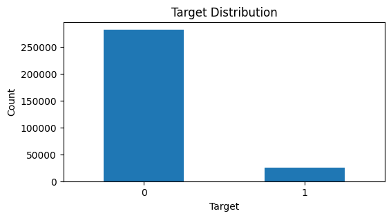
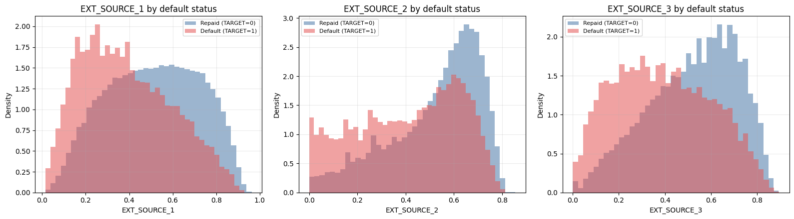
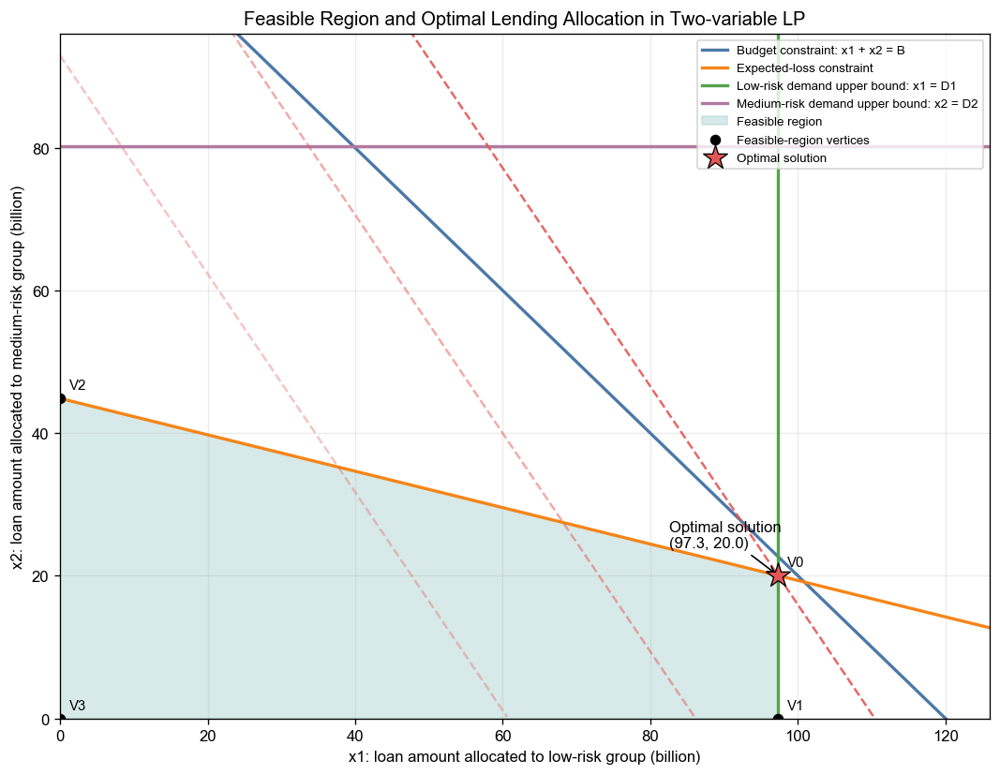
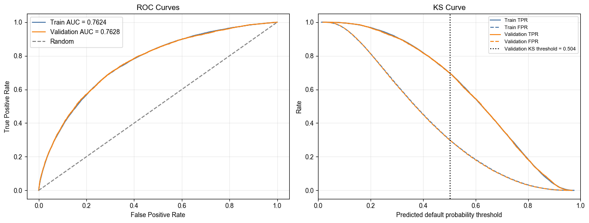
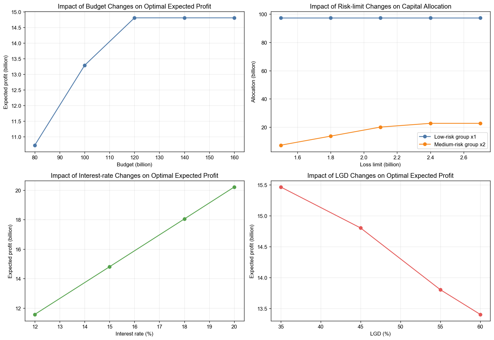

# Consumer Credit Scoring & Capital Allocation

> An end-to-end credit risk project that turns borrower data into an interpretable scorecard and a risk-constrained lending strategy.

**At a glance:** 8 linked credit tables · 307,511 labelled applications · 530 engineered features · 20-feature scorecard · validation AUC **0.7628** · validation KS **0.3994**

## 01 — Executive Summary

This project addresses a core consumer-lending decision: how can a lender approve more creditworthy applicants without taking unacceptable default risk? Eight linked Home Credit datasets were cleaned and transformed into applicant-level features, then used to build an interpretable Weight of Evidence (WOE) logistic-regression scorecard. The leakage-corrected model achieved a validation AUC of **0.7628** and KS of **0.3994**, with nearly identical training performance. Its calibrated probabilities of default were then connected to a linear-programming model that recommends how much capital to allocate to low- and medium-risk segments under a portfolio loss limit.

## 02 — Business Problem

Home Credit serves applicants who may have limited access to traditional bank financing. The commercial challenge is not simply to predict default; it is to balance three competing objectives:

- approve customers who are likely to repay;
- control expected credit losses;
- deploy lending capital where it creates the greatest expected return.

The project therefore supports two linked decisions:

1. **Customer risk decision:** rank applicants by probability of default and translate that risk into an interpretable credit score.
2. **Portfolio allocation decision:** determine how much capital to allocate to each eligible risk segment while respecting budget, expected-loss and demand constraints.

## 03 — Key Business Insights

### Insight 1: Default is infrequent, but too material to assess with accuracy alone

Only **24,825 of 307,511 applicants (8.07%)** defaulted. A model that predicts every applicant as non-default would appear highly accurate while providing almost no risk-management value. The project therefore evaluates ranking and separation with **ROC-AUC and KS**, rather than relying on accuracy.



**Why it matters:** model validation and approval policy must explicitly account for class imbalance, otherwise risky borrowers can be hidden by the majority class.

### Insight 2: External credit signals provide the clearest separation

The three external credit scores are among the strongest predictors in both exploratory analysis and the final scorecard. Average external scores were consistently lower for defaulted applicants:

- `EXT_SOURCE_1`: **0.3870** for defaulted vs **0.5115** for repaid applications;
- `EXT_SOURCE_2`: **0.4109** vs **0.5235**;
- `EXT_SOURCE_3`: **0.3907** vs **0.5210**.



**Why it matters:** external risk signals should remain central to underwriting, but they should be combined with repayment history, employment stability and affordability measures rather than used as a single approval rule.

### Insight 3: Risk capacity—not available capital—is the binding constraint

Under the base-case scenario, the optimal solution allocates **97.34B** currency units to the low-risk segment and **20.02B** to the medium-risk segment. It uses **117.36B** of the available **120B** budget because the **2.10B expected-loss limit binds first**.



**Why it matters:** adding budget alone does not improve expected profit once the loss limit is reached. Better probability calibration, risk monitoring and loss-mitigation capability create more value than simply making more capital available.

## 04 — Business Recommendations

1. **Prioritise the low-risk segment.** Fully fund eligible applicants with calibrated PD at or below 5%, subject to operational and policy checks.
2. **Use the medium-risk segment as the marginal growth pool.** Allocate capital selectively until the portfolio expected-loss limit is reached.
3. **Exclude negative-expected-profit applicants from routine lending.** In the base scenario, applicants above the 25% break-even PD should not enter the standard allocation pool.
4. **Operate a combined policy of customer PD, risk segments and portfolio quotas.** A single approval threshold cannot manage both customer-level and portfolio-level risk.
5. **Pilot before deployment.** Monitor realised default rate, expected versus realised loss, approval rate, profitability, calibration drift and fairness outcomes; recalibrate PD and LGD when performance moves outside tolerance.

## 05 — Business Impact & Validation

### Validated predictive performance

The final reported results come from the leakage-corrected pipeline, where the train/validation split occurs **before** fitting the binning and WOE mappings:

- training AUC: **0.7624**;
- validation AUC: **0.7628**;
- training KS: **0.3979**;
- validation KS: **0.3994**;
- 5-fold CV AUC on the model matrix: **0.7621 ± 0.0031**;
- average score: **564.41** for defaulted customers vs **635.76** for non-defaulted customers.

The close training and validation curves indicate stable ranking power with no visible train/validation performance gap.



### Simulated decision impact

Using a 15% lending return, 45% loss given default, 120B budget and 2.10B expected-loss limit, the optimisation model produces:

- expected profit: **14.804B** currency units;
- expected loss: **2.100B**;
- deployed capital: **117.357B**;
- unused budget: **2.643B**.

Sensitivity testing shows that profit plateaus once the risk limit becomes binding, increases with lending return, and declines as LGD rises.



> **Important:** these are scenario-based expected values, not realised business results. The dataset does not contain actual contract rates, LGD, funding costs, operating costs, capital charges or a real institutional risk limit.

## 06 — Analytical Approach


- **Data preparation:** standardised anomalous values, addressed missingness, checked duplicate identifiers and joined application, bureau, previous-loan, POS, credit-card and instalment histories.
- **Feature engineering:** created affordability and stability ratios, then aggregated historical numeric and categorical behaviour at loan and customer level.
- **Predictive modelling:** used WOE binning and logistic regression because interpretability, monotonic risk grouping and score mapping are valuable in credit operations.
- **Validation:** used a stratified holdout, ROC-AUC, KS and cross-validation because the target is highly imbalanced.
- **Prescriptive modelling:** maximised expected portfolio profit subject to budget, expected-loss and segment-demand constraints; tested budget, risk limit, interest-rate and LGD scenarios.

## Repository Guide

- [`01_Data_Preparation_and_EDA.ipynb`](01_Data_Preparation_and_EDA.ipynb) — data audit, cleaning, multi-table feature engineering, baseline model and EDA.
- [`02_Logistic_Regression_Scorecard_Full.ipynb`](02_Logistic_Regression_Scorecard_Full.ipynb) — full feature-selection research path, including PSI, IV, correlation filtering and forward selection.
- [`02_Logistic_Regression_Scorecard_Fast_Reproduction.ipynb`](02_Logistic_Regression_Scorecard_Fast_Reproduction.ipynb) — recommended final scorecard pipeline; reuses the selected 20 features and fits binning/WOE after the train/validation split.
- [`03_Prescriptive_Analytics_LP.ipynb`](03_Prescriptive_Analytics_LP.ipynb) — probability calibration, risk segmentation, LP allocation, solver validation and sensitivity analysis.
- [`assets/`](assets/) — figures extracted from existing Notebook outputs for this README.

The final performance figures in this README come from the **Fast Reproduction** notebook. The Full notebook documents the feature-search process; its historical holdout output should not be used as the final validation estimate because its original WOE transformation was fitted before the holdout split.

## Reproducing the Analysis

### 1. Download the data

Download the [Home Credit Default Risk](https://www.kaggle.com/competitions/home-credit-default-risk/data) competition data and place the CSV files in:

```text
dataset/
├── application_train.csv
├── application_test.csv
├── bureau.csv
├── bureau_balance.csv
├── credit_card_balance.csv
├── installments_payments.csv
├── POS_CASH_balance.csv
└── previous_application.csv
```

The raw data and generated PKL files are intentionally excluded because of their size and Kaggle distribution terms.

### 2. Install the main dependencies

```bash
pip install numpy pandas matplotlib seaborn scipy scikit-learn statsmodels joblib toad optbinning
```

Python 3.11 or 3.12 and at least **16 GB RAM** are recommended for the full feature-engineering workflow.

### 3. Run the notebooks

Run Jupyter from the repository root so that the relative `dataset/` paths resolve correctly:

```text
01_Data_Preparation_and_EDA.ipynb
    ↓
02_Logistic_Regression_Scorecard_Fast_Reproduction.ipynb
    ↓
03_Prescriptive_Analytics_LP.ipynb
```

The Full scorecard notebook is optional and substantially slower because it repeats the feature-search process.

## Assumptions and Limitations

- Home Credit application IDs are anonymised, and the analysis does not represent a production underwriting system.
- The optimisation uses continuous segment-level allocation, not applicant-level integer approval decisions.
- Base-case return, LGD, budget and loss limits are managerial scenario assumptions rather than observed contract parameters.
- The scorecard does not establish causality, and external scores may carry population or fairness risks that require governance review.
- Economic conditions, calibration drift, funding costs and operating costs may materially change realised outcomes.

## Project Context and Acknowledgements

This repository contains the analytical code from a University of Adelaide Business Analytics group project, prepared here as a portfolio case study. Data originates from the Kaggle Home Credit Default Risk competition. Feature-engineering and EDA ideas were informed by public Home Credit community work, including notebooks by Will Koehrsen, alongside course materials; only the final project notebooks are included in this repository.
