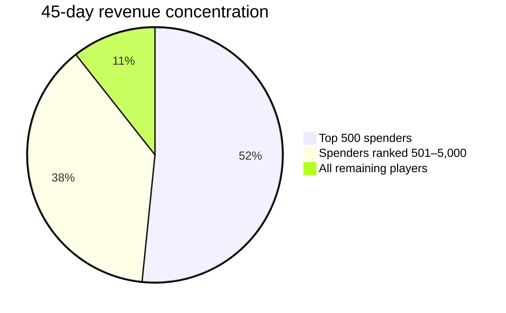
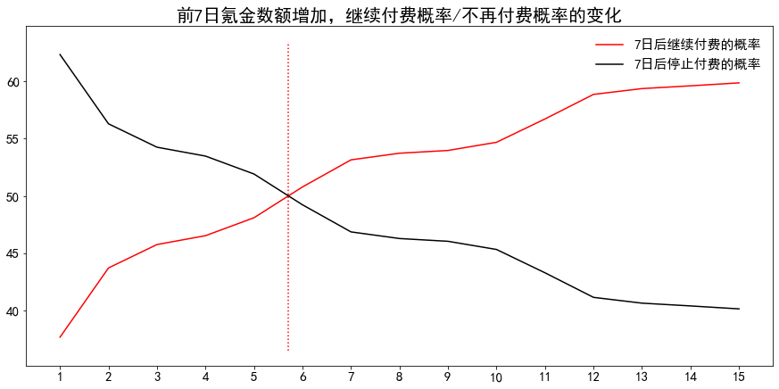
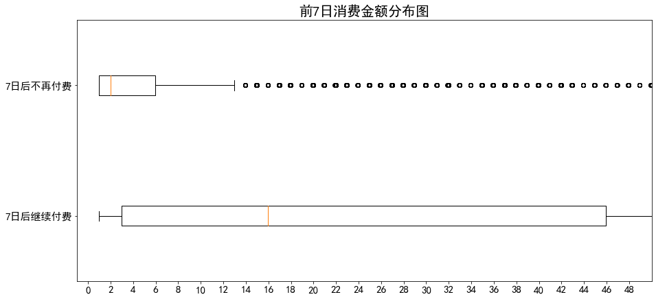

# SLG Multiplayer Mobile Game Spending Prediction

> A business analytics and machine-learning project for identifying high-value players early and forecasting their 45-day in-game spending.

Using **2.29 million player records** from tap4fun's *Brutal Age*, this project uses player behavior from the first seven days after registration to predict total spending over 45 days. It combines exploratory analysis with a two-stage classification-and-regression model to address an extremely zero-inflated target. The final holdout-set result reduces RMSE from **62.00** for the linear-regression baseline to **54.42**. The analysis gives game operations teams an actionable seventh-day decision point for player segmentation, offer design, and retention interventions.

**Related analysis:** [open the notebook](<SLG Multiplayer Mobile Game Spending Prediction.ipynb>) · **Dataset dictionary:** [tap4fun 数据字段解释.xlsx](<tap4fun原始数据/tap4fun 数据字段解释.xlsx>)

---

## 01 — Executive Summary（项目概览）

- **Business question:** How can the operations team identify high-value players early enough to allocate offers, service, and engagement resources effectively?
- **Work delivered:** analyzed first-seven-day behavior, quantified conversion and revenue concentration, engineered behavioral features, and built a two-stage spending-prediction model.
- **Most valuable finding:** spending in the first seven days is a strong leading indicator. Players who spend more than **¥6** during this period are more likely to keep spending than to stop.
- **Decision supported:** score players on day 7, then route them to differentiated offer, retention, and service strategies instead of applying uniform promotions.

## 02 — Business Problem（业务背景与问题）

Mobile-game revenue depends heavily on in-game purchases, yet most newly acquired players never become paying users. In this dataset, the target is each player's total spending within 45 days (`prediction_pay_price`); the model can only use behavior observed in the first seven days. The practical challenge is therefore not merely predicting a continuous value, but identifying the small set of players whose likely lifetime value justifies targeted operations.

The project addresses three decisions:

| Decision | Business question | Analytical response |
|---|---|---|
| Early conversion | Which new players are likely to spend after day 7? | Measure early-spending thresholds and predict payment propensity. |
| Resource allocation | Who merits premium service, offers, or retention investment? | Score predicted 45-day value on day 7 and create value tiers. |
| Product and offer design | Where should the conversion journey be improved? | Diagnose early churn, pricing thresholds, and the day 7–45 conversion gap. |

## 03 — Key Business Insights（核心业务洞察）

### Insight 1: Revenue is highly concentrated while overall conversion is low

Only **45,988 of 2,288,007 players (2.01%)** had positive 45-day spending. Those paying players generated **¥4.10M** in revenue, but the top 5,000 spenders—just **0.22% of all players**—contributed **89.38%** of it; the top 500 alone contributed **51.62%**.

**Why it matters:** a broad, undifferentiated promotion strategy wastes scarce operational capacity. Retaining and correctly serving a comparatively small high-value segment has disproportionate revenue impact, while onboarding must address the much larger non-paying population.

### Insight 2: The first seven days are the key monetization window

Among players with no spending in the first seven days, only **0.20%** became new payers by day 45—equivalently, **99.8% did not convert later**. Meanwhile, **72.71%** of early payers made no additional purchases after day 7. The continuation probability first exceeds the stop-spending probability when first-seven-day spending reaches **¥6** (**50.78% vs. 49.22%**).

**Why it matters:** the first-week experience and entry offer are the primary levers for both conversion and subsequent value. ¥6 is evidence for a testable starter-offer price band and a useful feature in day-7 segmentation—not a universal pricing rule.

  

  

## 04 — Business Recommendations（业务建议）

| Priority | Recommended action | Target group and trigger | Execution notes |
|---|---|---|---|
| P0 | Redesign the first-week conversion journey | New players in days 0–3; players who have not yet reached core resource and PVE milestones | Ensure basic city building, one PVE encounter, and a clear low-friction offer before early churn. |
| P0 | Test a ¥5–¥7 starter-offer ladder | Players approaching or exceeding ¥6 of first-week spending | Use controlled experiments: follow the entry offer with progressive offers rather than assuming the threshold is causal. |
| P1 | Deploy day-7 value scoring | All active players on day 7 | Route predicted high-value players (>¥50 predicted 45-day spend) to priority service and premium offers; use standard offers for ¥1–¥50; use low-cost re-engagement for predicted-zero players. |
| P1 | Add lifecycle offers after day 7 | Active non-payers and early payers on days 14 and 30 | Test growth offers around ¥12–¥20 and monthly privilege bundles; measure incremental conversion against a holdout group. |

## 05 — Business Impact & Validation（业务价值与验证）

### Validated analytical result

The model was evaluated on a held-out 40% test split. The two-stage model first predicts whether a player will pay, then estimates spending only for players selected by the classifier. It achieved an overall **RMSE of 54.42**, compared with **62.00** for the linear-regression benchmark—an offline error reduction of **12.2%**. The payment-propensity classifier achieved **ROC-AUC 0.971** on the test set.

> This is an **offline predictive validation**, not evidence of realized revenue uplift. Any operational intervention must be validated with a randomized A/B test and a pre-defined guardrail plan.

### Proposed experiment scorecard

| KPI | Current observed baseline | Decision use | Validation standard |
|---|---:|---|---|
| 45-day payer rate | 2.01% | Overall conversion health | Compare treatment and control cohorts. |
| Early-payer continuation rate | 27.29% | Effectiveness of first-week offer ladder | Measure incremental 45-day payer conversion among day-7 payers. |
| New payer rate after day 7 | 0.20% of initial non-payers | Effectiveness of day 14/30 interventions | Track incremental conversion and revenue net of offer cost. |
| ARPU / ARPPU | ¥1.79 / ¥89.21 | Monetization quality | Monitor lift together with retention and complaint/refund guardrails. |
| Prediction error | RMSE 54.42 | Model health | Re-evaluate on newer cohorts; monitor drift before operational rollout. |

## 06 — Analytical Approach（分析方法）

**Data.** The training set contains **2,288,007 rows × 109 columns**. It includes 107 first-seven-day behavioral features plus player ID and the 45-day spending label. Feature groups cover resource acquisition and consumption, troop activity, acceleration items, building and research levels, PVP/PVE activity, online duration, and seven-day spending. The notebook reports **no missing values and no duplicate rows**.

**Workflow.**

1. **Exploratory analysis:** assessed the target distribution, payer rate, ARPU/ARPPU, revenue concentration, online duration, resource skewness, combat behavior, and outliers.
2. **Feature engineering:** derived registration-time features, resource and level-up efficiency features, PVP behavior ratios, and business-rule flags informed by the exploratory findings.
3. **Preprocessing:** split data before outlier handling; applied special handling for outliers among non-payers, then min–max scaling. The optional power transformation was rejected because it destabilized RMSE.
4. **Modeling:** established linear-regression and tree-based benchmarks; then used logistic regression for payment propensity and Gradient Boosting Regression for spending conditional on predicted payment. The classification threshold was tuned to favor recall in this imbalanced setting.
5. **Evaluation:** used a 60/40 train/test split and evaluated regression with RMSE and R², while evaluating payment propensity with ROC-AUC, recall, and precision.

**Tools:** Python · Pandas · NumPy · Matplotlib · scikit-learn

**Data source:** Chengdu Nibiru Technology Co., Ltd. (tap4fun), provided for the DC Competition / Second Smart China Cup (ICC).
