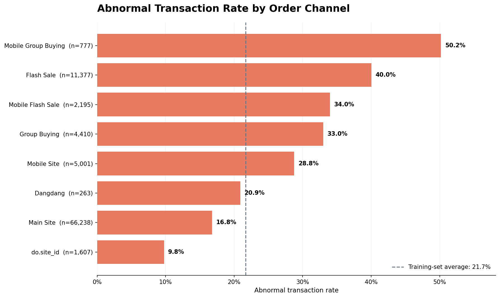
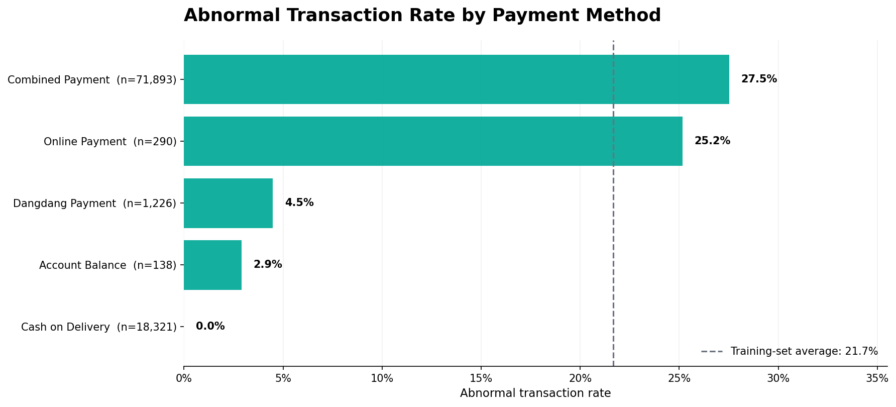
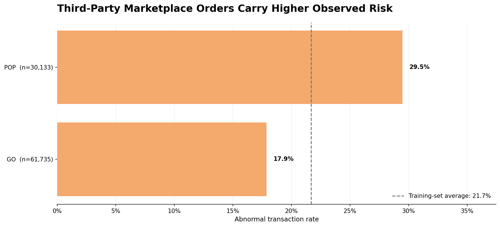

# E-commerce Abnormal Order Detection with Ensemble Learning

An end-to-end analytics and machine-learning project for identifying abnormal e-commerce transactions, engineering business-driven risk features, and combining tree-based models into an operational risk-scoring prototype.

**Dataset:** 131,282 cleaned transaction lines · **Target rate:** 21.5% abnormal · **Holdout design:** split by Order ID · **Final holdout AUC:** 0.8150

## 01 — Executive Summary

This project addresses the cost and operational risk created by abnormal e-commerce orders, including fabricated transactions, malicious ordering, promotion abuse, and transaction disputes. I cleaned 134,190 raw transaction records, identified an unreliable order-date field and artificial duplicates, engineered training-derived business risk features, and compared Random Forest, GBDT, and XGBoost models. The strongest cross-validation result reached an AUC of 0.9369, while a stricter unseen-order holdout evaluation produced an AUC of 0.8150 and accuracy of 0.8158. The solution can support risk-based review prioritization, but deployment thresholds and financial impact still require live validation.

## 02 — Business Problem

E-commerce platforms must distinguish legitimate orders from transactions that create fraud, fulfillment, promotion, or after-sales risk. Manual review does not scale across hundreds of thousands of transaction lines, while applying the same controls to every order increases customer friction and operating cost.

The project frames abnormal-order identification as a supervised binary-classification problem:

- **Class 0:** normal transaction
- **Class 1:** abnormal transaction
- **Primary evaluation metric:** ROC AUC
- **Secondary metric:** classification accuracy at a selected operating threshold

The analysis is designed to support three decisions:

1. Which orders should be released, reviewed, or intercepted?
2. Which channels, payment methods, and seller types require tighter controls?
3. Which model and monitoring strategy can generalize to previously unseen orders?

## 03 — Key Business Insights

All rates below are descriptive results from the 91,868-row training set. They indicate useful risk signals, not causal relationships.

### Insight 1: Promotion-heavy channels concentrate abnormal activity



Mobile group buying has a 50.2% abnormal rate and flash sales reach 40.0%, compared with 16.8% on the main site. Even allowing for smaller sample sizes in some channels, promotion-oriented traffic consistently sits above the 21.7% training average.

**Why it matters:** high-subsidy and urgency-driven campaigns appear more exposed to promotion abuse, fabricated transactions, or opportunistic ordering. Channel-specific controls are likely to be more efficient than a single platform-wide rule.

### Insight 2: Payment method is a strong risk-segmentation feature



Combined payment has a 27.5% abnormal rate across 71,893 observations, while cash on delivery records 0.0% across 18,321 observations in the training sample. Online payment is also high at 25.2%, although its sample contains only 290 observations and should be interpreted cautiously.

**Why it matters:** payment method can improve review prioritization and rule design. The large and stable combined-payment segment deserves particular attention, while small categories require minimum-volume rules or statistical smoothing before operational use.

### Insight 3: Third-party marketplace orders carry higher observed risk



Third-party POP transactions have a 29.5% abnormal rate, versus 17.9% for the GO direct-retail channel—an 11.6 percentage-point gap.

**Why it matters:** third-party seller governance, onboarding, and monitoring should receive greater risk-control capacity. The result supports differentiated controls by seller type rather than treating marketplace and direct-retail orders identically.

## 04 — Business Recommendations

| Priority | Recommended action | Target segment | Execution condition | KPI |
|---|---|---|---|---|
| P0 | Deploy probability-based risk tiers: release low-risk orders, manually review medium-risk orders, and temporarily hold the highest-risk orders. | All orders | Calibrate thresholds on review cost, false-positive cost, and required recall before launch. | Recall, precision, false-positive rate, review volume, review turnaround time |
| P0 | Add enhanced controls to mobile group buying, flash-sale, and group-buying campaigns. | Promotion-heavy channels | Require sufficient channel sample size and monitor campaign-specific drift. | Abnormal-order rate, blocked-loss rate, customer-friction rate |
| P1 | Introduce differentiated seller monitoring for POP merchants. | Third-party marketplace sellers | Combine model scores with seller tenure, dispute history, and fulfillment performance. | Merchant alert rate, confirmed abnormal rate, dispute rate |
| P1 | Use payment method as a review-routing signal rather than a standalone rejection rule. | Combined and online payments | Apply smoothing and minimum-volume thresholds to small categories. | Review yield, payment-level precision, false declines |
| P2 | Reconcile predictions at the order level so all transaction lines under one Order ID receive a consistent final decision. | Multi-line orders | Define a documented aggregation rule, such as maximum risk or majority vote. | Order-level AUC, inconsistent-line rate |

## 05 — Business Impact & Validation

### Validated offline results

| Stage | Evaluation design | Result | Interpretation |
|---|---|---:|---|
| Rough benchmark | Five-fold CV after full-data ordinal encoding | AUC 0.8289 | Useful reference, but optimistic because encoding was fitted before validation |
| Tuned XGBoost | Five-fold CV on engineered training data | AUC 0.9369 | Strong ranking performance; target-derived features still make this estimate optimistic |
| Weighted soft-voting ensemble | Training data | AUC 0.9608 | Measures fit, not deployment performance |
| Weighted soft-voting ensemble | Unseen Order-ID holdout | **AUC 0.8150** | Best indicator of current generalization to unseen orders |
| Weighted soft-voting ensemble | Unseen Order-ID holdout, threshold 0.7 | **Accuracy 0.8158** | Threshold-specific result; not sufficient by itself for deployment |

The order-level holdout contains 39,414 transaction lines from Order IDs absent from training. The gap between training and holdout performance indicates overfitting and distribution shift, especially around high-cardinality IDs and target-derived aggregate features.

### Expected value, not yet validated in production

No live financial uplift, prevented-loss value, or reduction in manual-review cost has been measured. The model is a validated offline prototype. A production pilot should measure:

- prevented abnormal-order value;
- manual reviews per confirmed abnormal order;
- false-positive rate and legitimate-customer friction;
- precision and recall by channel, payment method, and seller type;
- feature drift, score drift, and unseen-category rate;
- realized savings net of review and intervention costs.

## 06 — Analytical Approach

### Data and cleaning

- Source data contains sampled 2013 online transactions from a large Chinese electronics and appliance retailer.
- The raw dataset contains 134,190 rows and 14 fields.
- Rows with missing values were removed because missingness was rare and weakly associated with the target.
- Eight exact duplicates and 1,471 artificially replicated normal rows were removed.
- Order Date was dropped after repeated Order IDs showed identical transaction details with altered dates and an implausibly uniform monthly distribution.
- The final cleaned dataset contains 131,282 rows and 13 fields.

### Feature engineering

| Feature family | Transformation | Business rationale |
|---|---|---|
| Time | Extracted hour and half-hour indicator | Captures potential off-hours ordering patterns |
| Payment, channel, category, and province | Training-derived abnormal-rate features | Quantifies historical risk at a business-relevant level |
| User, product, and brand | Risk rates with minimum-history rules and unseen-category fallbacks | Retains high-cardinality risk information while limiting sparse-category overfitting |
| Order amount | K-means discretization and bin-level mean | Represents long-tailed value ranges and extreme-order behavior |
| Quantity | High-quantity binary flag | Isolates unusually large transaction lines |

### Modeling and validation flow

```text
Raw transactions
      │
      ├── Missing-value, duplicate, and unreliable-date treatment
      │
      ├── 70:30 split by Order ID
      │
      ├── Training-derived feature engineering and encoding
      │
      ├── Random Forest ─┐
      ├── GBDT ─────────┼── Weighted soft voting ──> Risk probability
      └── XGBoost ──────┘
```

The three component models were evaluated with five-fold cross-validation and tuned across class weighting, tree count, learning rate, and maximum depth. Final generalization was assessed on an Order-ID holdout so that transaction lines from the same order could not appear on both sides of the split.

### Limitations

- The data is historical and sampled; current customer behavior may differ.
- Abnormal labels are provided without a detailed operational definition.
- Several aggregate features use the target and should be generated out-of-fold inside cross-validation in a production-grade pipeline.
- The final holdout AUC of 0.8150 is materially below training and CV results, so calibration and regularization remain necessary.
- Descriptive risk differences across channels or regions should not be interpreted as causal effects.

### Project files

- [Part 1 — Business Background & Data Exploration](<Part 1 - Business Background & Data Exploration.ipynb>)
- [Part 2 — Feature Engineering & Model Tuning](<Part 2 - Feature Engineering & Model Tuning.ipynb>)
- `data/abnormal_order2_en.csv` — cleaned English-schema dataset
- `data/train_en.csv` and `data/test_en.csv` — final engineered model inputs
- `generate_readme_charts.py` — reproducible README chart generator

### Reproduce the README charts

```bash
source .venv/bin/activate
python generate_readme_charts.py
```

The executed notebooks already contain their outputs, figures, package-compatible fixes, and final validation results.
