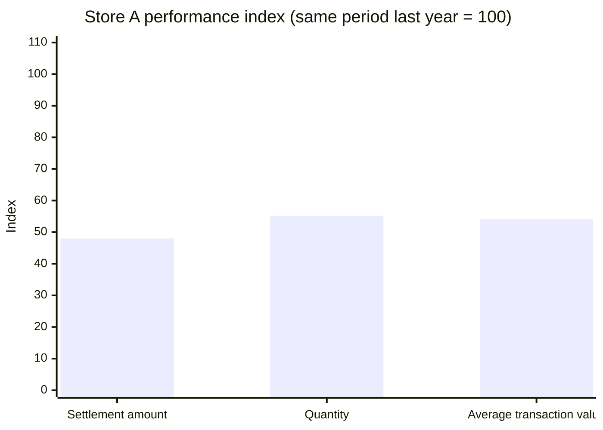
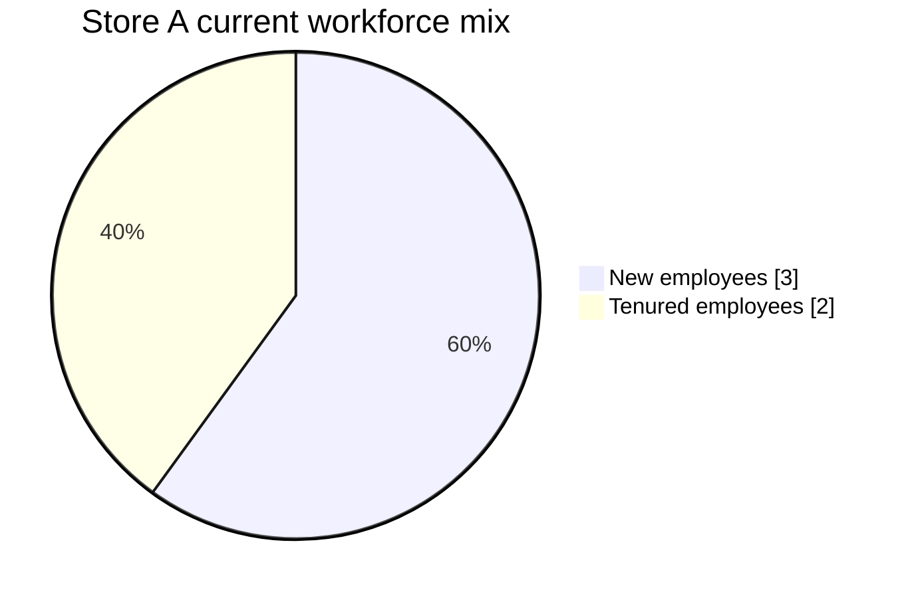
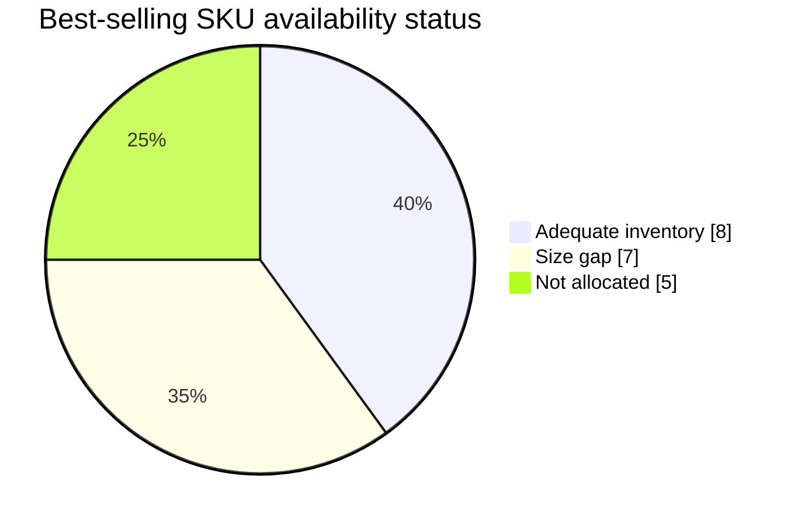

# Retail Operations Analysis: People, Product, and Store Diagnostics

> **Portfolio case study** · Microsoft Excel · Retail operations · Inventory analysis · Store performance · Data visualisation

## 01 — Executive Summary

This project brings sales, workforce, customer, SKU, inventory-transfer, and industry-turnover data into one Excel-based retail operating review. The analysis identifies a sharp decline in Store A's current-month **Settlement Amount** (**85,248** versus **177,429** in the same period last year; **-52.0%**) alongside a mismatch between inventory availability and product demand. Only **8 of 20 best-selling SKUs** have adequate size availability; five are not allocated at all and seven have size gaps. The workbook translates these findings into decisions on replenishment and transfer, slow-stock reduction, staffing, and VIP customer recovery.

---

## 02 — Business Problem

A retail manager needs to improve sales without simply increasing stock or discounting every product. The operating challenge is to determine whether weak performance is driven by demand, product availability, assortment quality, service capacity, customer mix, or a combination of these factors.

This analysis answers four practical questions:

- Where has Store A's commercial performance deteriorated versus the comparable prior period?
- Which product and size combinations should be replenished, transferred, or investigated first?
- Which slow-moving SKUs are tying up inventory with weak sell-through?
- How should workforce capacity and VIP customer performance shape the recovery plan?

The intended users are store operations, merchandising, inventory-planning, and CRM teams.

---

## 03 — Key Business Insights

### 1. Sales, basket size, and average transaction value have all weakened

Store A's current-month **Settlement Amount** is **85,248**, down **52.0%** from **177,429** in the same period last year. Quantity declined **44.8%** (666 versus 1,207), Customer Units per Transaction declined **37.8%** (1.50 versus 2.40), and Average Transaction Value declined **45.8%** (191.57 versus 353.44).

**Why it matters:** the decline is broader than a single KPI. The store should diagnose product availability and service execution before relying on blanket discounts, which may further weaken realised value.

### 2. Workforce capacity and VIP contribution are both under pressure

Store A has **5 employees against a planned 7** and **3 of the 5 current employees are new** (60%). At the same time, VIP Settlement Amount fell from **35,375** to **6,807** (**-80.8%**), and VIP Settlement Amount Share fell from **19.9%** to **8.0%** (**-12.0 percentage points**).

**Why it matters:** the data does not prove that staffing caused the sales decline, but the simultaneous staffing gap, high proportion of new employees, and deterioration in VIP contribution make service coverage, onboarding, and customer follow-up high-priority areas to test.

### 3. Fast-moving products are unavailable in the sizes customers need, while slow-moving stock is heavy

Of 20 best-selling SKUs, only **8 (40%)** have adequate size availability. **5 SKUs (25%)** have no allocation and **7 (35%)** have size gaps. Separately, the 20 slow-moving SKUs hold **244 units** against **65 units sold**, an aggregate inventory-to-sales ratio of **3.75**.

**Why it matters:** inventory is not merely a volume problem; it is an assortment and allocation problem. Reallocating available slow stock will not automatically solve lost sales unless the receiving store gets the correct SKU-size combination.

### Operating snapshot

| Area | Current period | Same period last year | Change / condition |
| --- | ---: | ---: | --- |
| Settlement Amount | 85,248 | 177,429 | -52.0% |
| Quantity | 666 | 1,207 | -44.8% |
| Average Transaction Value | 191.57 | 353.44 | -45.8% |
| Customer Units per Transaction | 1.50 | 2.40 | -37.8% |
| VIP Settlement Amount Share | 8.0% | 19.9% | -12.0 pp |
| Store staffing | 5 current / 7 planned | — | 2-person gap; 60% new employees |
| Best-selling SKUs with adequate availability | 8 of 20 | — | 40% adequate |
| Slow-moving SKU inventory-to-sales ratio | 3.75 | — | 244 units on hand / 65 units sold |

---

## 04 — Business Recommendations

| Priority | Target | Recommended action | Execution condition | KPI |
| --- | --- | --- | --- | --- |
| 1 | Five unallocated and seven size-gap best sellers | Replenish or transfer the required SKU-size combinations first; validate demand and available stock before placing new orders. | Use store-level sales and size demand, not product totals alone. | Best-seller availability; size-gap rate; lost-sales proxy. |
| 2 | Slow-moving SKU inventory | Pause or reduce replenishment, move suitable stock to higher-demand stores, and test targeted clearance only where transfer is not viable. | Protect margin; avoid discounting stock that can be transferred. | Inventory-to-sales ratio; sell-through; markdown rate. |
| 3 | Store A service coverage | Close the two-person staffing gap and run a short product, service, and VIP-clienteling onboarding plan for new employees. | Schedule experienced coverage during peak periods. | Conversion rate; Customer Units per Transaction; Average Transaction Value; training completion. |
| 4 | VIP customers | Run a segmented win-back and appointment/outreach test for Lost or lower-spending VIP customers. | Use a holdout group to measure incremental effect. | VIP Settlement Amount Share; repeat visit rate; incremental VIP Settlement Amount. |
| 5 | Assortment planning | Use the SKU attributes—colour, capacity, network standard, and contract type—to plan inventory at the variant level. | Refresh the analysis on a regular trading cadence. | Variant-level availability; stock-out rate; forecast error. |

The recommended sequence is to correct high-demand availability first, reduce slow-stock exposure second, and then use service and CRM interventions to recover basket quality and VIP value.

---

## 05 — Business Impact & Validation

The workbook diagnoses operational opportunities; it does **not** contain intervention data, margin data, traffic data, or a controlled experiment. Therefore, it does not claim that any action will produce a specific revenue uplift.

To validate the recovery plan:

1. Establish a weekly baseline for best-seller availability, size-gap rate, stock-outs, sell-through, and inventory-to-sales ratio.
2. Pilot the allocation and transfer rules in a defined set of stores or product variants; compare results with a comparable control group where possible.
3. Track sales conversion, Customer Units per Transaction, Average Transaction Value, and VIP Settlement Amount Share before and after each intervention.
4. Separate the effect of replenishment, staffing coverage, and CRM activity rather than attributing every sales change to one action.

The most useful decision KPIs are:

- Best-seller availability and size-gap rate, starting from the current **40% adequate-availability** baseline
- Slow-moving inventory-to-sales ratio, starting from **3.75**
- Settlement Amount, Customer Units per Transaction, and Average Transaction Value versus the same-period benchmark
- VIP Settlement Amount Share, starting from **8.0%**
- Staff coverage versus the planned headcount of **7**

---

## 06 — Analytical Approach

### Workbook structure

| Worksheet | Analytical purpose |
| --- | --- |
| **Inventory Transfer** | Compares store inventory by size before and after a transfer decision. |
| **Inventory Turnover** | Benchmarks inventory balances and turnover ratios across dairy, beer, and baijiu companies. |
| **Product SKU Data** | Provides a variant-level product matrix using colour, capacity, network standard, and contract type. |
| **People, Product & Store Method** | Consolidates store sales, staffing, VIP contribution, best-seller availability, and slow-moving inventory. |

### Methods

1. **Compare sales performance** — Calculate year-over-year change for Quantity and Settlement Amount, then compare Customer Units per Transaction and Average Transaction Value across periods.
2. **Assess service capacity** — Compare planned versus current headcount and calculate the share of employees with less than three months of service.
3. **Measure customer value mix** — Calculate VIP Settlement Amount Share as VIP Settlement Amount divided by Total Settlement Amount.
4. **Diagnose assortment availability** — Flag best-selling SKUs as adequately stocked, size-constrained, or not allocated based on their size-level inventory.
5. **Evaluate slow stock** — Calculate the inventory-to-sales ratio for slow-moving SKUs and identify zero-stock exceptions.
6. **Benchmark inventory turnover** — Compare inventory balance and turnover ratio across selected companies to add an external inventory-efficiency perspective.

### Why this approach?

The People, Product & Store framework is useful for retail operations because it prevents a single-metric diagnosis. It connects commercial results to the operational levers managers can actually change: staffing and capability, customer engagement, variant-level assortment, inventory allocation, and transfer decisions.

### Tools

- Microsoft Excel
- Formula-driven operational KPIs and year-over-year comparisons
- SKU and size-level inventory analysis
- Inventory turnover benchmarking
- Excel charts and decision-oriented business recommendations
