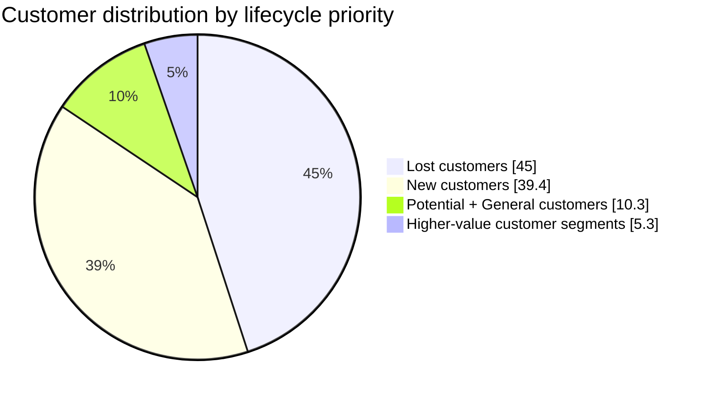
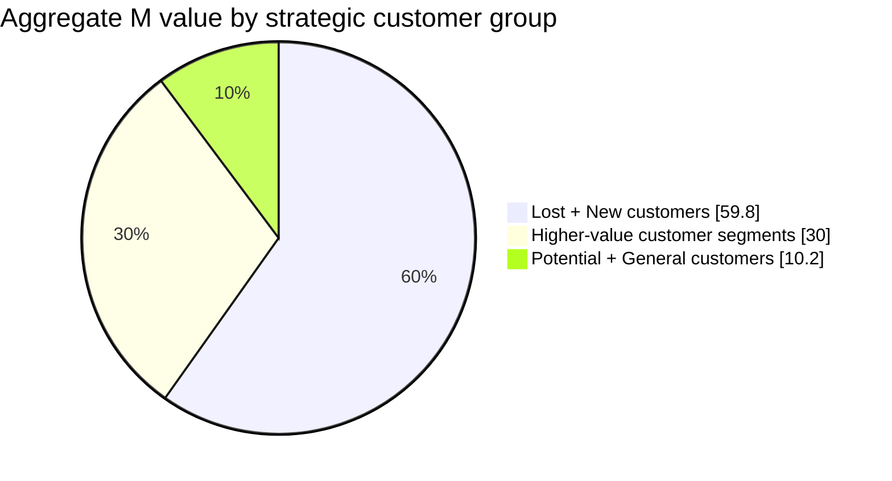

# E-Commerce Customer Value Analysis with RFM Segmentation

> **Portfolio case study** · Microsoft Excel · RFM segmentation · PivotTables · Data visualisation

## 01 — Executive Summary

This project turns e-commerce transaction records into an actionable customer-value view using **Recency, Frequency, and Monetary (RFM)** analysis. I prepared customer-level metrics, assigned rule-based RFM labels, and summarised the results in an Excel dashboard with PivotTables and charts. The analysis covers **3,403 customers** with approximately **239,424 monetary units of aggregate customer-level M value**. In this workbook, **M is the customer's average order amount**, not cumulative spend; the dashboard's `Cumulative Spend` heading is the sum of these customer-level M values. The key finding is that Lost and New customers together account for **84.4% of the customer base** and **59.8% of aggregate M value**, making reactivation and second-purchase conversion the two most important commercial priorities. The output is designed to help a marketing or CRM team decide who to retain, nurture, reactivate, and protect.

---

## 02 — Business Problem

Transaction data alone does not tell a business which customers deserve different treatment. A single, undifferentiated campaign can waste budget on low-propensity audiences while overlooking high-value customers who are at risk of leaving.

The business questions were:

- Which customers are most valuable and should receive retention treatment?
- Which Lost customers are worth trying to win back?
- Which recent customers should be moved quickly to a second purchase?
- How should limited CRM and campaign resources be prioritised by customer value and lifecycle stage?

This analysis supports customer lifecycle management, campaign targeting, and retention planning rather than a one-size-fits-all promotional strategy.

---

## 03 — Key Business Insights

### 1. The customer base is dominated by Lost and New customers

Lost customers are the largest segment (**1,531 customers; 45.0%**), while New customers are close behind (**1,341 customers; 39.4%**). Together, these two groups represent **2,872 customers (84.4%)** and approximately **143,213 monetary units (59.8%)** of aggregate M value.

**Why it matters:** the portfolio is not yet balanced around repeat, loyal customers. The business should run separate reactivation and second-purchase programmes before simply increasing broad acquisition spend.

### 2. A small High-Potential segment contributes disproportionately to M value

Only **81 customers (2.4%)** are classified as *High-Potential Customers*, but they contribute approximately **35,080 monetary units (14.7%)** of aggregate M value. Their average M value is about **6.2×** the portfolio-wide customer average.

| Segment | Customers | Share of customers | Cumulative value | Share of value |
| --- | ---: | ---: | ---: | ---: |
| High-Potential Customers | 81 | 2.4% | 35,080 | 14.7% |
| High-Value Customers | 19 | 0.6% | 6,957 | 2.9% |
| Key Win-Back Customers | 5 | 0.1% | 2,014 | 0.8% |

**Why it matters:** losing even a small number of these customers could have an outsized revenue effect. They should be protected with differentiated service, relevant offers, and early-warning retention triggers.

### 3. Reactivation is a material value-recovery opportunity

Lost customers account for approximately **74,397 monetary units (31.1%)** of aggregate M value. This is a large enough pool to justify a focused win-back test rather than treating all inactive customers as equally low priority.

**Why it matters:** reactivation candidates should be prioritised by historic M value, not only by recency. A Lost customer with a high historical M value may be more valuable than a recently acquired low-value customer.

### Segmentation snapshot

| RFM customer label | Customers | Customer share | Aggregate M value | M value share |
| --- | ---: | ---: | ---: | ---: |
| Lost customers | 1,531 | 45.0% | 74,397 | 31.1% |
| New customers | 1,341 | 39.4% | 68,816 | 28.7% |
| Potential customers | 226 | 6.6% | 16,865 | 7.0% |
| General customers | 126 | 3.7% | 7,477 | 3.1% |
| High-Potential Customers | 81 | 2.4% | 35,080 | 14.7% |
| Recoverable Customers | 74 | 2.2% | 27,819 | 11.6% |
| High-Value Customers | 19 | 0.6% | 6,957 | 2.9% |
| Key Win-Back Customers | 5 | 0.1% | 2,014 | 0.8% |
| **Total** | **3,403** | **100.0%** | **239,424** | **100.0%** |

---

## 04 — Business Recommendations

| Priority | Target segment | Recommended action | Success signal |
| --- | --- | --- | --- |
| 1 | Lost customers, prioritised by historic M value | Run a time-limited win-back campaign with personalised product recommendations or a service-recovery message. | Incremental reactivation rate and repeat purchase value versus a holdout group. |
| 2 | New customers | Trigger a post-purchase journey: confirmation, product education, cross-sell recommendation, and a second-purchase incentive. | 30/60/90-day second-purchase rate and time to second order. |
| 3 | High-Potential and High-Value Customers | Offer differentiated retention treatment such as priority support, relevant replenishment reminders, or VIP access. | Retention rate, purchase frequency, and average customer value. |
| 4 | Potential and general customers | Test low-cost personalised recommendations before using deeper discounts. | Conversion uplift and incremental value per campaign cost. |

Campaign sequencing matters: protect the highest-value active relationships first, convert New customers into repeat customers second, and then test reactivation offers on the Lost customer pool.

---

## 05 — Business Impact & Validation

This workbook identifies opportunities; it does **not** claim realised revenue uplift because no campaign experiment or post-intervention data is included. The following validation plan would turn the analysis into measurable business impact:

1. Split each target segment into treatment and holdout groups before sending a campaign.
2. Track incremental conversion, repeat purchase rate, purchase frequency, customer-level M value, and campaign cost over 30, 60, and 90 days.
3. Compare results with the holdout group, not just pre/post changes, to estimate true incremental impact.
4. Refresh RFM scores on a regular schedule and move customers between segments as their behaviour changes.

The most useful KPIs are:

- Reactivation rate and incremental value from Lost customers
- Second-purchase rate for new customers
- Retention rate and value per customer for high-value segments
- Incremental value per campaign cost
- Segment migration: for example, New → Potential → High-Potential

---

## 06 — Analytical Approach

### Workflow

1. **Prepare transaction data** — Retain the original customer identifier, order identifier, transaction date, order status, and paid amount; standardise dates and values while preserving the source dataset in the English workbook.
2. **Build customer-level features** — Aggregate each customer's most recent payment time, order count, and average order amount.
3. **Calculate RFM metrics** — Measure:
   - **Recency (R):** how recently a customer purchased;
   - **Frequency (F):** how often the customer purchased; and
   - **Monetary value (M):** the customer's average order amount in the workbook.
4. **Score and label customers** — Convert the three metrics into ordinal scores and apply transparent rules to produce the workbook's labels: New, Potential, High-Potential, Key Win-Back, General, Recoverable, High-Value, and Lost.
5. **Summarise and visualise** — Use Excel PivotTables and charts to compare customer counts, aggregate M value, and percentage contribution by segment.
6. **Translate results into actions** — Map each customer group to a lifecycle objective, campaign idea, and measurable KPI.

### Why RFM?

RFM is appropriate here because it is transparent, fast to operationalise in Excel, and directly connects purchasing behaviour to CRM action. It creates a shared language between analysts and commercial teams without requiring a black-box model.

### Tools

- Microsoft Excel
- Excel formulas and customer-level aggregation
- RFM scoring and rule-based segmentation
- PivotTables and PivotCharts
- Data visualisation and business recommendation design
