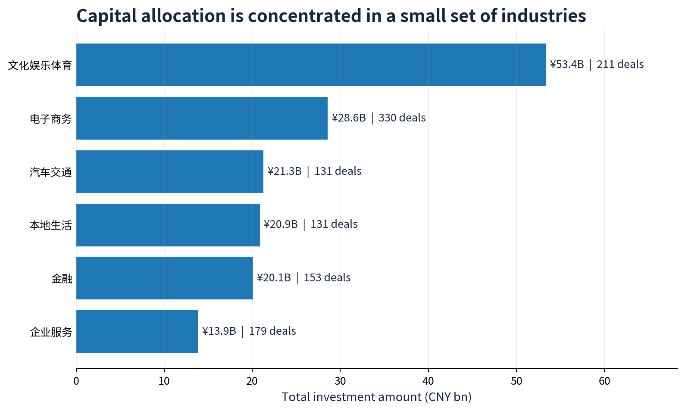
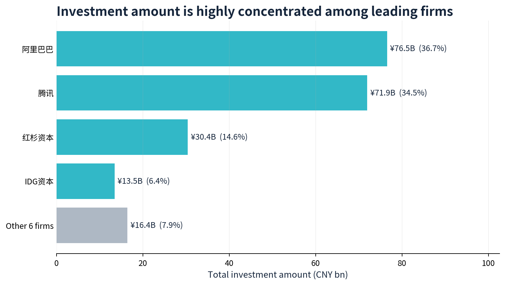
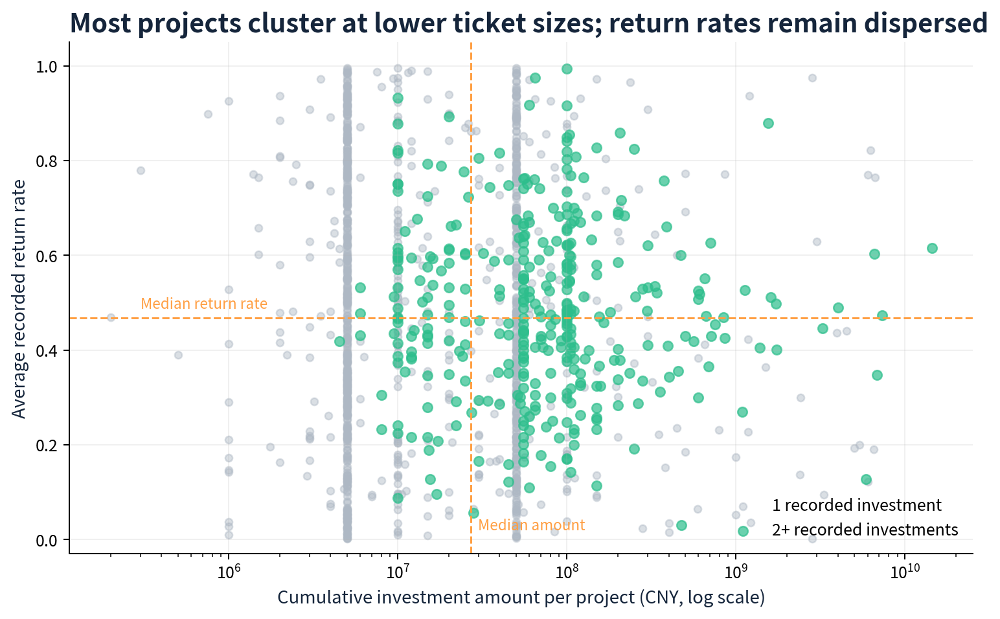

# Investment Strategy Analysis of Top 100 Venture Capital Firms

**Tableau | Exploratory Data Analysis | Investment Landscape | Portfolio Storytelling**

[View the interactive Tableau dashboard](https://public.tableau.com/views/01InvestmentStrategyAnalysisofTop100VentureCapitalFirms/sheet0?:language=zh-CN&:sid=&:redirect=auth&:display_count=n&:origin=viz_share_link)

> **Portfolio scope.** This is a descriptive Tableau portfolio project based on the supplied historical investment dataset. The raw file covers **1,974 investment records**, **1,424 projects**, **18 industries**, and **10 named investment institutions** from **1999-06-07 to 2016-05-10**.

---

## 01 — Executive Summary（项目概览）

This project turns fragmented historical investment records into an interactive decision-support dashboard for examining where capital has flowed, which institutions have deployed it, and how investment size and the dataset's return-rate indicator vary by industry and funding stage. I built an end-to-end Tableau story covering market overview, investment trends and returns, and project/institution exploration. The analysis shows a highly concentrated market: the top three named institutions account for **85.7%** of recorded investment amount, while the six largest industries account for **75.7%**. These views support a first-pass investment-screening conversation—where to investigate, how to benchmark a potential co-investor, and which stage/industry combinations require deeper diligence—rather than a causal or predictive investment recommendation.

**Decision supported:** prioritise research and diligence capacity across industries, stages, projects, and potential investment partners using a consistent evidence base.

---

## 02 — Business Problem（业务背景与问题）

Investment teams often need to turn a large volume of deal records into a concise market view before deciding where to focus sourcing and due diligence. The source data contains deal location, time, industry, funding round, project, institution, amount, and a return-rate field, but it is difficult to compare these dimensions in a spreadsheet alone.

This analysis addresses four practical questions:

1. **Where has capital concentrated?** Identify the industries, regions, and projects receiving the most observed investment.
2. **Who is shaping the market?** Compare the investment scale and preferences of the named institutions.
3. **How do stage and ticket size relate to the recorded return-rate indicator?** Surface patterns worth validating in investment committee research.
4. **Where should analysts look next?** Create an interactive, filterable view that narrows a broad market scan into candidate sectors, stages, and projects.

The intended use is prioritisation and hypothesis generation. It should not be used to infer that a higher historical return-rate field was caused by a particular round, industry, or institution.

---

## 03 — Key Business Insights（核心业务洞察）

### 1) Capital flow and deal volume point to different priorities

The six largest industries by recorded investment amount absorb **75.7%** of all observed capital. Culture, entertainment and sports leads with **¥53.4B (25.6%)**, while e-commerce has the largest number of investment records (**330**) despite a lower total amount of **¥28.6B**. Capital concentration and deal frequency therefore should be evaluated separately: an active deal market is not automatically the market receiving the largest tickets.

**Why it matters:** sector screening should use both capital intensity and deal flow. This avoids prioritising a sector only because it has many visible transactions, or only because it has a few very large transactions.



### 2) Recorded capital is concentrated among a small group of institutions

Alibaba (**¥76.5B**), Tencent (**¥71.9B**), and Sequoia Capital (**¥30.4B**) together represent **85.7%** of the dataset's total recorded investment amount. Adding IDG Capital brings the share to **92.1%**. This is a strong concentration signal within the included sample, although it is **not** a claim about the complete venture-capital market because only ten institutions are represented.

**Why it matters:** use leading institutions as benchmarks for sector and stage research, but validate any apparent “market share” against a complete external universe before using it for partner selection or competitive strategy.



### 3) Most projects have lower recorded ticket sizes, while return rates remain dispersed

Angel, A, and B rounds account for **82.3%** of recorded investments. At a project level, the median cumulative recorded investment amount is **¥27.15M** and the median of project-average return rates is **46.8%**. The scatterplot shows that most projects cluster at lower investment amounts but span a wide range of return-rate values; a small number of high-ticket projects form a long tail.

**Why it matters:** a simple “large ticket = better return” rule is not supported by this descriptive view. A practical screening process should assess stage, sector, follow-on history, and return-rate context together, and flag sparse high-return segments for further diligence rather than treating them as proof of superiority.



---

## 04 — Business Recommendations（业务建议）

| Priority | Recommended action | Decision use | Guardrail |
|---|---|---|---|
| 1 | Build a sector–stage screening matrix using investment amount, deal count, project count, and median return rate. | Focus analyst sourcing and diligence time on segments that combine sufficient opportunity volume with a risk/return profile the team understands. | Do not rank a segment on average return rate alone; review sample size and outliers. |
| 2 | Benchmark candidate co-investors against the dashboard's institution and industry views. | Identify comparable sector exposure and potential overlap before initiating partnership research. | The data contains only 10 named institutions, so enrich it with a complete and current market dataset before making competitive claims. |
| 3 | Require a project-level review for high-ticket or repeat-funded opportunities. | Direct senior review to the long-tail projects that can materially change capital allocation. | Verify return-rate definitions, realised exits, valuation changes, and missing data outside this dataset. |

---

## 05 — Business Impact & Validation（业务价值与验证）

### What has been validated

The figures in this README are reproducible descriptive summaries of the supplied historical file. The Tableau workbook provides an interactive way to filter and explore those summaries by time, region, institution, industry, funding round, and project.

### What has **not** been validated

This is a portfolio/learning project, not a deployed investment workflow. It has not produced verified financial returns, cost savings, or decision-speed improvements. The provided `回报率` (return-rate) field is treated as a source indicator; it is not documented as IRR, MOIC, or realised cash return.

### Post-deployment validation plan

| Outcome to validate | KPI | Measurement approach |
|---|---|---|
| Faster market screening | Median time from market-scan request to shortlist | Compare the workflow before and after dashboard adoption for comparable research requests. |
| Better evidence coverage | % of investment-committee briefs with sector, stage, concentration, and peer-benchmark evidence | Audit submitted briefs monthly. |
| Better decision quality | Follow-on rate, realised/mark-to-market return, and loss rate versus the team's benchmark | Track cohorts by decision date and stage; report at 12/24/36 months. |
| Trustworthy reporting | Refresh success rate, data-completeness rate, and number of reconciled exceptions | Monitor every refresh and retain an exception log. |

---

## 06 — Analytical Approach（分析方法）

### Data source and scope

The primary input is [`投资数据.txt`](投资数据.txt), a UTF-16, tab-separated file with 12 fields: record ID, city, founding year, investment date, industry, funding round, project, institution, province/region, project description, investment amount, and return rate. The packaged Tableau workbook contains an embedded `.hyper` extract, so it can be opened independently of the raw text file.

### Workflow

```text
Raw investment records
        ↓
Data audit and type conversion
  • parse investment dates
  • validate numeric amount / return-rate fields
  • inspect coverage by institution, industry, region, and period
        ↓
Feature engineering in Tableau
  • founding date: DATE(DATEPARSE("y", LEFT([成立时间], 4)))
  • investments per project: { FIXED [投资项目] : COUNT([投资轮次 (组)]) }
  • grouped funding rounds and Tableau clustering
        ↓
Exploratory analysis and visual storytelling
  • map and time trend for investment overview
  • tree map / area and dual-axis views for investment direction
  • funding-round distribution, return-rate comparison, and project clustering
        ↓
Interactive Tableau dashboard and recommendations
```

### Tableau deliverables

| Dashboard / story area | Analytical purpose | Tableau techniques used |
|---|---|---|
| Investment overview | Explore investment location, projects, and change over time | Geographic map, temporal analysis, tooltips |
| Investment direction | Compare institutions, industries, and projects | Area chart, tree map, interactive filtering |
| Investment & return | Examine amount and return-rate patterns by time and funding round | Dual-axis trend, box plot, grouped rounds |
| Project exploration | Surface investment/return profiles and institution preferences | Scatterplot, clustering, detail-on-demand |