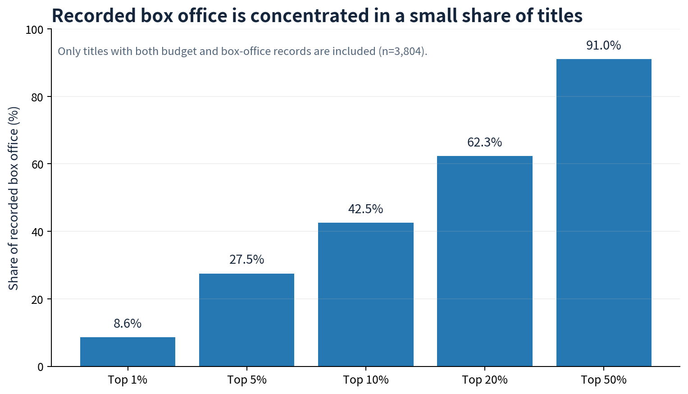
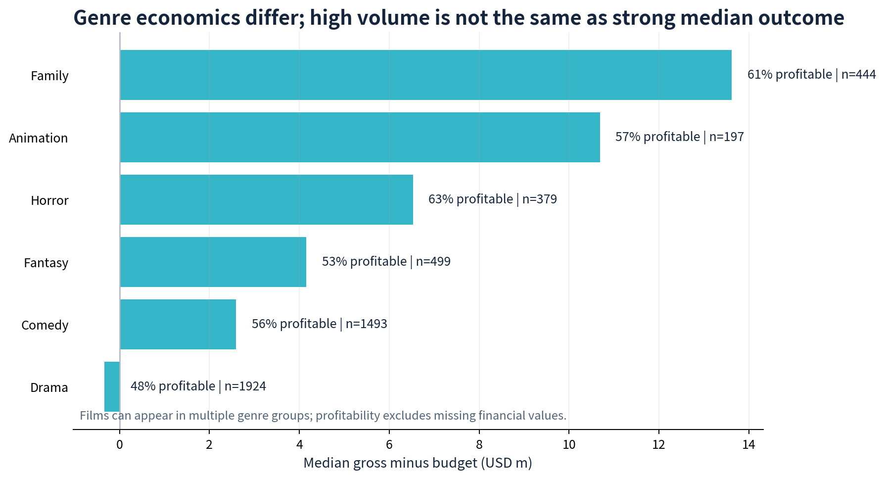
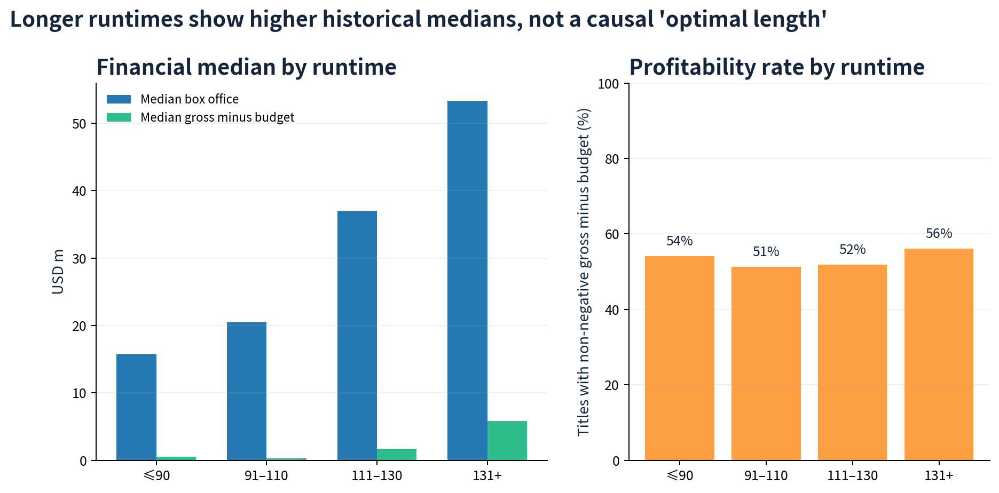

# Data-Driven Analysis for Successful Film Production

**Tableau | Entertainment Analytics | Greenlight Decision Support | Visual Storytelling**

[View the interactive Tableau dashboard](https://public.tableau.com/views/02Data-DrivenAnalysisforSuccessfulFilmProduction/1_4?:language=zh-CN&:sid=&:redirect=auth&:display_count=n&:origin=viz_share_link) · [Download the packaged Tableau workbook](02%20Data-Driven%20Analysis%20for%20Successful%20Film%20Production.twbx)

> **Portfolio scope.** This is a historical, descriptive learning/portfolio project built from an IMDb-derived film dataset. It covers **4,937 movie records**, **65 countries/regions**, and release years from **1916–2016**. The project is designed to support greenlight research and slate planning; it does not predict a film's outcome or establish that any observed factor causes box-office success.

---

## 01 — Executive Summary（项目概览）

Film-production teams must make early choices about genre, budget, creative talent, story, and runtime with incomplete evidence and highly skewed financial outcomes. This Tableau project combines a movie master table with normalised genre and plot-keyword data to examine market structure, profitability, genre economics, creative choices, and runtime. Among the **3,804 titles with both box-office and budget values**, only **52.5%** have non-negative box office minus budget, while the top **10%** of titles generate **42.5%** of recorded box office. The dashboard therefore supports a disciplined greenlight conversation: construct a diversified slate, test individual projects against comparable films, and treat genre or runtime signals as evidence to investigate—not deterministic rules.

**Decision supported:** prioritise development and diligence resources across potential genres, budget bands, creative profiles, and runtimes before committing production capital.

---

## 02 — Business Problem（业务背景与问题）

Studios and producers need to select projects before their commercial performance is observable. A spreadsheet of historical titles makes it difficult to see whether high box office is broadly repeatable or driven by a small number of outliers, and how the answer changes by genre, story, talent, and runtime.

This analysis addresses five greenlight questions:

1. **How concentrated is box-office performance?** Quantify downside risk instead of relying on average grosses.
2. **Which genre profiles merit deeper development research?** Compare title volume, budget, gross, and the share of titles with non-negative gross minus budget.
3. **How should runtime be used in planning?** Benchmark a proposed length against historical ranges without claiming a universal optimum.
4. **Which directors, actors, plot keywords, and markets warrant further investigation?** Make these dimensions filterable for project-level due diligence.
5. **What data constraints could bias a decision?** Surface missing financial values, historical coverage, and source-market concentration before making a recommendation.

The dashboard is a decision-support and hypothesis-generation tool. It should be paired with current audience research, distribution assumptions, production and marketing costs, rights availability, and commercial judgement.

---

## 03 — Key Business Insights（核心业务洞察）

### 1) Box-office outcomes are highly concentrated, so averages conceal greenlight risk

Of the 3,804 titles with usable gross and budget values, **52.5%** have non-negative `box office − budget`. The top **1%** of titles contribute **8.6%** of recorded box office, the top **10%** contribute **42.5%**, and the top **50%** contribute **91.0%**. This long-tailed pattern means that a large headline average can be produced by a relatively small number of breakout titles.

**Why it matters:** a greenlight case should use downside scenarios and comparable-title distributions, not only mean box office. The remaining **22.9%** of records lack either gross or budget, so missingness must be visible in any investment discussion.



### 2) Genre volume and genre economics are different signals

In the financial-record subset, Family titles have a median `gross − budget` of **$13.6M** with **61%** non-negative outcomes (`n=444`); Animation has **$10.7M** and **57%** (`n=197`); Horror has **$6.5M** and the highest share among these selected genres at **63%** (`n=379`). By contrast, Drama is the largest genre group shown (`n=1,924`) but has a median result of **−$0.3M** and **48%** non-negative outcomes.

**Why it matters:** a slate should distinguish repeatable unit economics from category volume. These figures help choose comparable films and budget envelopes for development, but they do not prove that selecting a genre will create a profitable film—titles can carry multiple genre labels and unobserved creative/distribution factors remain important.



### 3) Longer titles have higher historical financial medians, but runtime is not a standalone lever

Titles running **131+ minutes** show a median recorded box office of **$53.3M** and median `gross − budget` of **$5.9M**, compared with **$15.7M** and **$0.5M** respectively for titles at or below 90 minutes. However, non-negative-outcome rates are much closer across runtime bands (**51%–56%**). Runtime is likely correlated with genre, budget, franchise status, audience, and distribution scale.

**Why it matters:** use runtime as a constraint to benchmark against comparable projects—not as a universal “longer is better” rule. A proposed length should be reviewed jointly with the intended genre, target audience, budget, and release strategy.



---

## 04 — Business Recommendations（业务建议）

| Priority | Recommended action | Decision use | Guardrail |
|---|---|---|---|
| 1 | Make comparable-title distributions mandatory in each greenlight brief: genre mix, budget range, runtime, market, and recent distribution model. | Replaces a single “average box office” estimate with base/downside/upside cases. | Exclude titles with missing financial fields from financial-rate calculations and display their count separately. |
| 2 | Build a diversified genre slate rather than concentrating only on the largest-volume category. Use Family/Animation and controlled-budget Horror as hypotheses for further research. | Balances potential upside with observed unit-economics signals. | Validate audience demand, marketing spend, release window, and rights constraints; genre labels overlap and historical data is not causal. |
| 3 | Treat runtime as a comparable-set feature. Escalate projects that sit far outside the runtime range of successful peers for creative and distribution review. | Identifies assumptions that need evidence before budget approval. | Do not impose a runtime target from this dashboard alone; control for genre, budget, franchise, and market in a follow-up model. |
| 4 | Introduce a data-quality gate before portfolio reporting. | Prevents incomplete gross/budget fields from being silently interpreted as loss-making titles. | Preserve an explicit `Unknown` status for missing financial information. |

---

## 05 — Business Impact & Validation（业务价值与验证）

### What has been validated

All values in this README are reproducible descriptive summaries of the included historical data. The Tableau story makes the source data explorable across market, genre, plot keyword, director, actor, financial result, and runtime dimensions.

### What has **not** been validated

This is a portfolio project, not a deployed studio workflow. It has not generated verified revenue uplift, budget savings, or improved greenlight hit rate. `票房` (box office) and `预算` (budget) are treated as the source dataset's USD-style values; the dataset does not document inflation adjustment, marketing/P&A spend, distribution terms, or realised producer return. Therefore `gross − budget` is a simple screening proxy—not profit, ROI, IRR, or net cash return.

### Post-deployment validation plan

| Outcome to validate | KPI | Measurement approach |
|---|---|---|
| Better estimate quality | Median absolute percentage error between forecast and actual box office | Compare pre-greenlight forecast versions with actual outcomes by release cohort. |
| Better capital discipline | % of greenlight briefs with base/downside/upside cases and comparable-title evidence | Audit completed approvals each month. |
| Better portfolio outcomes | Slate-level realised gross, contribution margin, and hit rate versus approved benchmark | Track by budget band, genre, region, and distribution model after release. |
| Higher data trust | Gross/budget completeness rate and number of reconciled exceptions | Monitor each data refresh; report an explicit `Unknown` financial-status count. |

---

## 06 — Analytical Approach（分析方法）

### Data sources

| File | Role in the analysis | Coverage |
|---|---|---|
| [`moviedata.xlsx`](moviedata.xlsx) | Master movie-level dataset: title, market, language, release year, directors, actors, social signals, reviews, runtime, box office, budget, rating, and IMDb link | 4,937 rows; 27 fields |
| [`电影类型.xlsx`](电影类型.xlsx) | Normalised movie-to-genre mapping | 14,191 movie–genre records |
| [`电影情节.xlsx`](电影情节.xlsx) | Normalised movie-to-plot-keyword mapping | 23,579 movie–keyword records |

### Workflow

```text
Movie master table + genre table + plot-keyword table
        ↓
Data profiling
  • check financial-field completeness and date coverage
  • treat zero social-follower values as missing where appropriate
  • retain a separate Unknown state for missing financial values
        ↓
Feature engineering in Tableau
  • profitability proxy: IF [票房] - [预算] >= 0 THEN "盈利" ELSE "亏损" END
  • annual box office: { FIXED [电影名], [电影年份] : AVG([票房]) }
  • genre/plot-level fixed calculations and box-office ranking
  • box-office bins and director clustering
        ↓
Interactive exploration and visual storytelling
  • market overview and box-office benchmark
  • genre, plot, director, actor, and runtime selection views
        ↓
Greenlight hypotheses, portfolio recommendations, and validation KPIs
```

### Tableau deliverables

| Dashboard / story area | Analytical purpose | Tableau techniques used |
|---|---|---|
| 市场概况及票房标准 | Assess market composition, financial balance, box-office distribution, and trend | Map, dual-axis trend, pie/distribution chart, bins |
| 选择电影类型 | Compare genre economics and associated plot-keyword patterns | Normalised data, FIXED LOD calculations, ranking, interactive filtering |
| 选择导演 / 选择演员 | Explore creative profiles alongside reviews, follower signals, and box office | Clustering, scatter/bubble views, detail-on-demand |
| 选择电影时长 | Benchmark runtime against gross and genre context | Scatterplots, size/color encodings, filters |