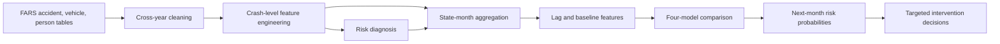

# Fatal Traffic Accident Risk Analytics

**Risk diagnosis, next-month forecasting, and decision support using U.S. fatal crash data (2015–2024)**

[](https://www.python.org/)
[](https://jupyter.org/)
[](https://www.nhtsa.gov/research-data/fatality-analysis-reporting-system-fars)

## 01 — Executive Summary

This project analyses ten years of U.S. Fatality Analysis Reporting System (FARS) data to help road-safety agencies decide **where, when, and how to allocate limited intervention resources**. It presents an end-to-end analytical workflow that combines crash-, vehicle-, and person-level records into 358,460 fatal-crash observations and a 6,069-row state-month modelling panel. The analysis identifies statistically significant severity drivers and predicts whether a state's next month will exceed its own 12-month fatal-crash baseline by at least 20%. On the 2023–2024 holdout period, the selected Logistic Regression model achieved **0.818 AUC** and **76.8% recall**, supporting an early-warning approach that prioritises detecting high-risk periods.

## 02 — Business Problem

U.S. road-safety resources—including enforcement capacity, infrastructure budgets, and public-awareness funding—are limited. Ranking states only by total crash volume systematically favours large states and can miss unusual risk increases in smaller jurisdictions.

The project therefore addresses three connected business questions:

1. **Risk diagnosis:** Which behavioural, environmental, vehicle, and demographic factors are associated with multi-fatal crashes?
2. **Risk forecasting:** Which state-months are likely to experience an abnormal increase in fatal crashes next month?
3. **Decision support:** How should agencies translate those findings into targeted interventions?

The intended users are the National Highway Traffic Safety Administration (NHTSA), state departments of transportation, law-enforcement agencies, road planners, and safety advocacy organisations.

## 03 — Key Business Insights

### Insight 1: Fatal-crash burden remains structurally elevated

The dataset contains **358,460 fatal crashes and 389,190 fatalities** across 51 jurisdictions. Fatal crashes increased from 32,538 in 2015 to a peak of 39,785 in 2021, before declining to 36,297 in 2024. Despite the recent decline, the 2024 total remained approximately **11.6% above the 2015 level**.

**Why it matters:** A post-2021 decline should not be interpreted as resolution of the problem. Agencies still need sustained, risk-based resource allocation rather than short-term reductions in safety investment.

**Supporting chart:** See Notebook **§2.1 — Annual trend**.

### Insight 2: Young-driver involvement and rural roads are the strongest severity indicators

After controlling for state, year, and month effects, the full Logistic Regression model found that:

- Young-driver involvement was associated with **1.50× the odds** of a multi-fatal crash.
- Rural-road crashes were associated with **1.42× the odds**.
- Alcohol-related and speed-related crashes were associated with approximately **1.17×** and **1.16× the odds**, respectively.

Pedestrian involvement produced an odds ratio below one for the specific outcome of *multiple fatalities in one crash*. This does **not** imply that pedestrian crashes are safe; it reflects their frequent single-victim structure and requires a separate pedestrian-risk indicator.

**Why it matters:** Safety programmes should distinguish between factors that drive overall crash volume and factors that increase the probability of multiple deaths.

**Supporting chart:** See Notebook **§3.3 — Odds ratios of key risk factors**.

### Insight 3: The intervention mix should differ by state

The 2024 risk profiles show materially different patterns:

- **Texas:** 3,774 fatal crashes; speed-related share of 35.7%.
- **California:** 3,583 fatal crashes; pedestrian-related share of 36.4%.
- **Florida:** 2,931 fatal crashes; pedestrian-related share of 31.3%, but a much lower speed-related share of 10.7%.
- **North Carolina:** 1,509 fatal crashes; rural-road share of 61.3% and speed-related share of 40.8%.

Nationally, 49.8% of 2024 fatal crashes occurred under dark or low-light conditions, while 39.8% occurred on rural roads.

**Why it matters:** Applying the same intervention everywhere would misallocate resources. The model also identifies relative anomalies in smaller jurisdictions that an absolute-volume ranking would overlook.

**Supporting charts:** See Notebook **§2.5 — Selected state risk profiles** and **§4.6–4.7 — Predicted high-risk state-months**.

## 04 — Business Recommendations

### 1. Introduce a tiered state-month early-warning process

Combine the model's predicted probability with the current fatal-crash level relative to the state's 12-month baseline:

- **High predicted probability + already above baseline:** deploy immediate targeted intervention.
- **High predicted probability + not yet above baseline:** increase monitoring and prepare low-cost preventive action.
- **Low predicted probability + temporarily above baseline:** conduct incident review before committing recurring resources.
- **Low predicted probability + near baseline:** maintain routine monitoring.

### 2. Match interventions to each state's risk profile

- Prioritise **night-time DUI and speed enforcement** where alcohol, speed, and dark-condition shares are high.
- Direct **road engineering, lighting, shoulder, and emergency-response investment** toward rural-risk states.
- Prioritise **crosswalk visibility, pedestrian refuge islands, traffic calming, and lower-speed urban corridors** where pedestrian involvement is high.
- Schedule campaigns and enforcement before forecast high-risk months instead of distributing resources evenly throughout the year.

### 3. Use relative and absolute risk together

Relative-to-baseline alerts identify unusual increases, while absolute crash volume measures the potential scale of harm. Decision-makers should use both measures to avoid overreacting to volatility in small states or ignoring high-burden large states.

## 05 — Business Impact & Validation

### Validated analytical performance

- **Temporal design:** 2015–2021 training, 2022 validation, and 2023–2024 holdout testing.
- **Models compared:** Logistic Regression, Decision Tree, Random Forest, and XGBoost.
- **Selected model:** Logistic Regression.
- **Holdout performance:** AUC 0.818, recall 0.768, accuracy 0.709, precision 0.357, and F1 0.487.
- **Operational interpretation:** the model detected approximately **77% of actual high-risk state-months** in the holdout period.

Recall is prioritised because missing a genuinely high-risk period may carry a higher public-safety cost than issuing an additional monitoring alert. The lower precision means the model should support—not replace—expert judgement.

### KPIs for a real-world pilot

This project has not been deployed in a live agency, so it does not claim realised reductions in fatalities. A pilot implementation should monitor:

- alert recall and precision by state size;
- number of high-risk months identified before the risk materialises;
- intervention lead time;
- change in fatal crashes relative to each state's historical baseline;
- cost per targeted intervention;
- false-alert workload for operational teams;
- differences in outcomes between intervention and comparable non-intervention periods.

## 06 — Analytical Approach

### Data source

The analysis uses public data from the [NHTSA Fatality Analysis Reporting System (FARS)](https://www.nhtsa.gov/research-data/fatality-analysis-reporting-system-fars), covering 2015–2024.

Three source tables are integrated:

- `accident`: crash time, location, fatalities, weather, lighting, road context, and pedestrian involvement;
- `vehicle`: alcohol, speeding, vehicle count, and prior driver violations;
- `person`: age, fatality status, restraint use, and road-user type.

### Data engineering

1. Standardise cross-year encodings, column names, and identifiers.
2. Aggregate vehicle and person records to crash level before joining, preventing many-to-many duplication.
3. Build a 358,460-row crash-level analytical dataset.
4. Aggregate records into 6,120 state-month observations.
5. Engineer lagged crash counts, rolling baselines, seasonal variables, and risk-factor shares.

### Statistical inference

A binomial Logistic Regression estimates the association between risk factors and whether a crash produces at least two fatalities. The full model includes state, year, and month fixed effects and HC1 robust standard errors. Odds ratios and 95% confidence intervals are used for business interpretation.

### Predictive modelling

The target is:

```text
next_month_high_risk = 1
if next month's fatal crashes >= 120% of the state's trailing 12-month baseline
```

The workflow compares Logistic Regression, Decision Tree, Random Forest, and XGBoost using AUC, recall, precision, accuracy, F1, confusion matrices, and ROC curves. State and month are one-hot encoded; numerical features are imputed, and scaled where required.

## Project Workflow



## Technology Stack

- Python 3.9
- Jupyter Notebook
- pandas and NumPy
- Matplotlib and Seaborn
- statsmodels
- scikit-learn
- XGBoost

## Repository Contents

```text
Fatal Traffic Accident Risk Analytics/
├── README.md
└── group6 final code.ipynb
```

The notebook contains the complete data pipeline, exploratory analysis, regression models, machine-learning comparison, evaluation results, and embedded visualisations.

## Reproducing the Analysis

1. Download the 2015–2024 FARS National CSV files from NHTSA.
2. Place the `accident`, `vehicle`, and `person` files under:

```text
dataset/
├── FARS2015NationalCSV/
│   ├── accident.csv
│   ├── vehicle.csv
│   └── person.csv
└── ... through FARS2024NationalCSV/
```

3. Install the required packages:

```bash
pip install jupyter pandas numpy matplotlib seaborn statsmodels scikit-learn xgboost
```

4. Run the notebook from the repository root:

```bash
jupyter notebook "group6 final code.ipynb"
```

The notebook generates cleaned data, figures, model outputs, and result tables under `output/`.

## Limitations

- FARS contains fatal crashes only; results should not be interpreted as risk estimates for all road crashes.
- The analysis does not include exposure denominators such as population, traffic volume, or vehicle miles travelled.
- Statistical findings represent associations, not causal effects.
- Monthly counts in smaller jurisdictions are volatile, so relative-risk alerts should be considered alongside absolute crash counts.
- Model performance should be revalidated over time before operational deployment.

## Data Attribution

Fatality Analysis Reporting System (FARS), National Highway Traffic Safety Administration, U.S. Department of Transportation.
